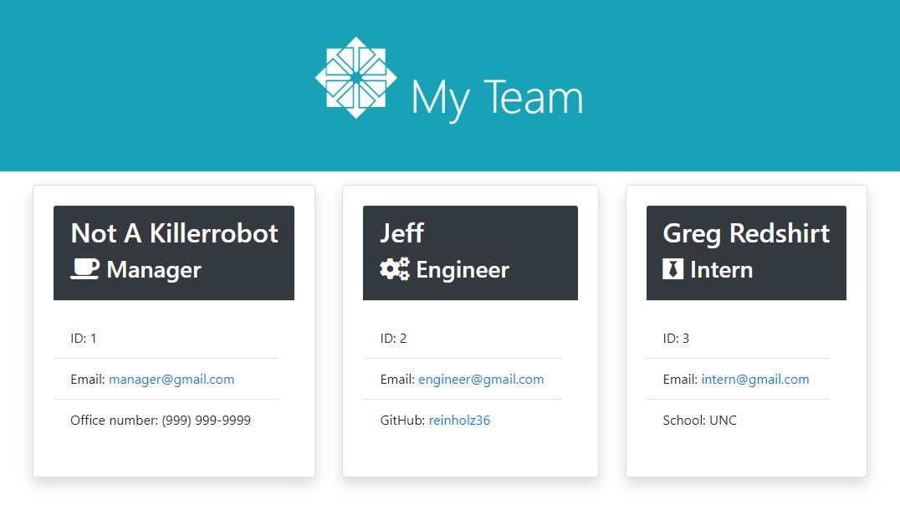

# Team-Profile-Generator

## Overview: 

I built a team profile generator using node.js and inquirer that can be run through the terminal. I tested the team classes and methods using Jest.  The user is prompted to answer a series of questions that help generate a team profile html page. 

## Technologies used: 
  * HTML
  * Bootstrap
  * JavaScript
  * Jest
  * Inquirer

Link to video demonstration: 